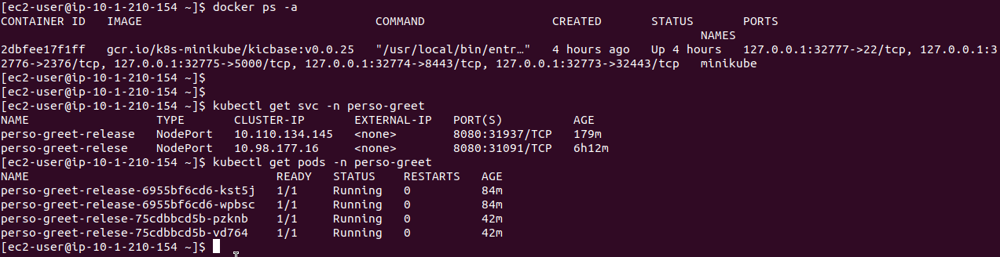

# These were the changes and fixes made to the code:

1. The "inventory" file had the wrong "ansible_host" parameter, so it was necessary to put the correct IP address
to deploy correctly, both Jenkins and minikube, using the provided playbooks

2. The Dockerfile_Jenkins_Master underwent the following changes:
   - The RUN commands were grouped into a single instruction to reduce the number of layers in the Docker image and improve the efficiency of the build.
   - In the RUN command where the docker group is being created and the Jenkins user is being added, I added a check to see if the docker group already exists.
   - I also added a check to see if the version of the plugin being installed is compatible with the Jenkins version.
   - A permissions check of the "jenkins_master_casc.yaml" file was added before its copy to "/var/jenkins_home/casc.yaml".

3. The path "/usr/local/bin/docker:/usr/local/bin/docker" was added to the docker-compose volumes.

4. It was also necessary to change the permissions of the pem keys using the command "chmod 400 file-name" and move them into the "deployment" folder.

After these changes, it is only necessary to run the command "ansible-playbook -i inventory deploy_jenkins" and "ansible-playbook -i inventory deploy_minikube" in the "deployment" folder, and both servers will be up and running.

In case the login screen continues to show up, you can use the following command at the end of the Dockerfile_Jenkins_Master:

"USER root
RUN sed -i 's/<useSecurity>true<\/useSecurity>/<useSecurity>false<\/useSecurity>/g' /var/jenkins_home/config.xml
USER jenkins"

5. It was necessary to add a "--no-cache -t" flag in the docker build command to setup jenkins, this change was made in the main.yml file in setup_jenkins/tasks/main.yml.

6. I changed the plugins list to retrieve the latest version of them, and added 6 different ones, like pipeline-utility-steps:latest for example.

7. I also changed the folder structure in the repo so Jenkins could see the Jenkinsfile better.

8. I had to change 'ansible_ssh_private_key_file' parameter to 'deployment/skey.pem' in the ansible inventory file.

9. I changed 'src' parameter content "{{ project_path }}/{{ image }}.tar" to just "{{ image }}.tar" in the 'copy image to remote' step in the main.yml file of copy_image tasks.

After these changes I was able to:

- Deploy a new Jenkins master using deployment playbook: Jenkins is up and running in its latest version.
- Deploy the minikube development environment via playbook: Minikube is up and running.
- Connect the Jenkins to a git VCS: I was able to connect Jenkins to my personal GitHub profile.
- Use webhook for each commit push (no polling): Jenkins is able to play the Jenskinsfile after any commit to the master branch
- Use jenkins credentials when needed: admin credentials are working just fine.
- Create a multi-branch pipeline using the provided Jenkinsfile and run it successfully
- Run the `deploy_app_to_minikube.yml` playbook development to deploy the `greet` chart with helm to minikube development env: I had an error (fatal: [minideploy]: FAILED! => {"changed": false, "content": "", "elapsed": 1, "msg": "Status code was -1 and not [200]: Request failed: <urlopen error [Errno 111] Connection refused>", "redirected": false, "status": -1, "url": "http://192.168.49.2:31937/greeting?name=Jhon"}) in the last step of the pipeline, wich is responsible for the last verification on the app, but I was able to run the playbook, deploy the helm charts and create a successfull cluster with healthy pods.

Here follows some pics as proof in case the servers shutdown:

Link to the github repository: https://github.com/lamaral-devops/PersoneticsTest